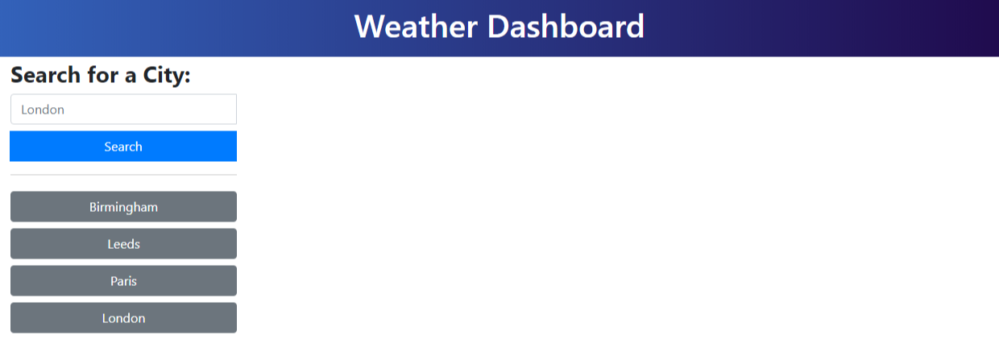
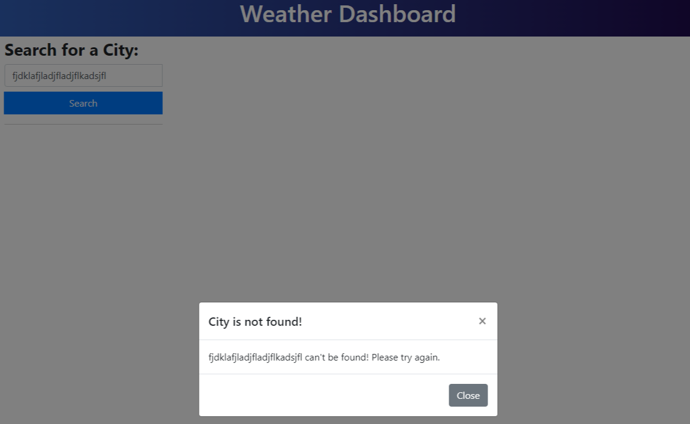
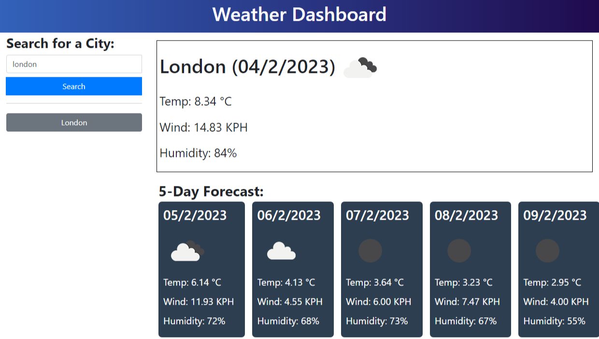

# Weather Dashboard

## Description

The application gets the weather forecast for cities using 5 Day/3 Hour Forecast API and Geocoder API from [OpenWeather](https://openweathermap.org). All cities that have been searched for are stored in the local storage and they will be retrieved back to the application everytime the application is loaded. The weather result is split into two part. The key information about the weather including the temperature, wind speed and humidity for today shows on the top and the 5-day weather forecasts are shown at the bottom.
 

## Table of Contents

- **[How Does It Work](#how-does-it-work)**
  - [Landing Page](#landing-page)
  - [City Not Found](#city-not-found)
  - [Weather](#result)
- [Deployment](#deployment)
- [Authors](#authors)
- [License](#license)

 

## How does it work

### Landing Page

This is the landing page where the user can do a search for a city on the search bar. All buttons below the search bar are the cities that was previously search for in the history. User can click on any city buttons to get the weather without retyping the city again in the search bar. The weather will be shown on the right panel.

 

### City Not Found

If the application can't find the city from the search, a modal pops up to tell user to try again.

 

### Get Weather From Search

The weather for the city that user searches for is shown on the right panel. The top part shows the temperature, wind speed and humidity of the city for today. The bottom part gives the 5-day weather forecasts for the city.

## Deployment

Find out the weather for a city <a href="https://mingzhao91.github.io/weather-dashboard/" target="_blank">here</a>.
 

## Authors

- **Mingzhao Zhou** - <a href="https://github.com/Mingzhao91" target="_blank">Mingzhao91</a>
   

## License

This project is licensed under the MIT License.
